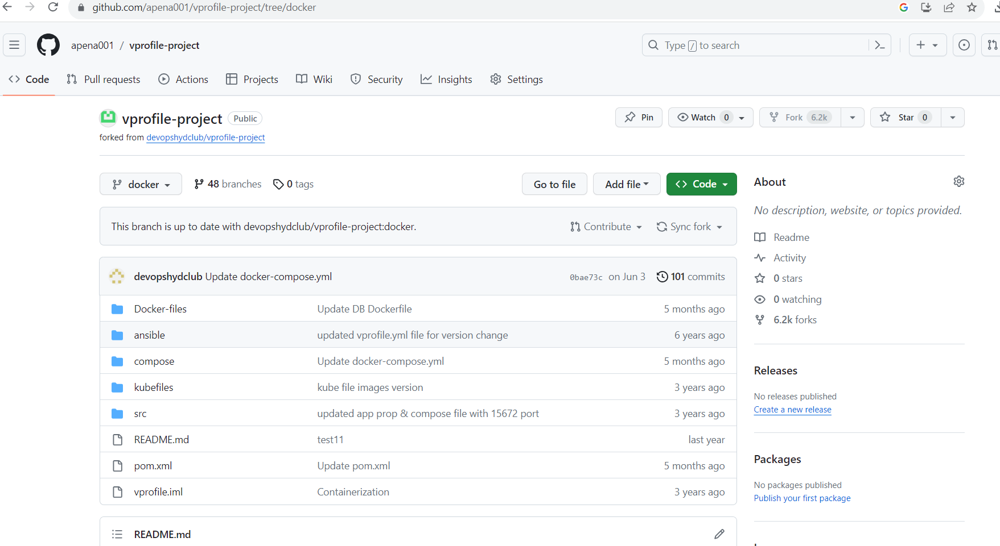
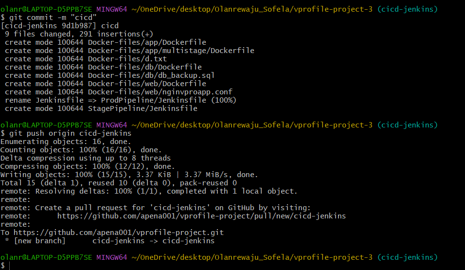
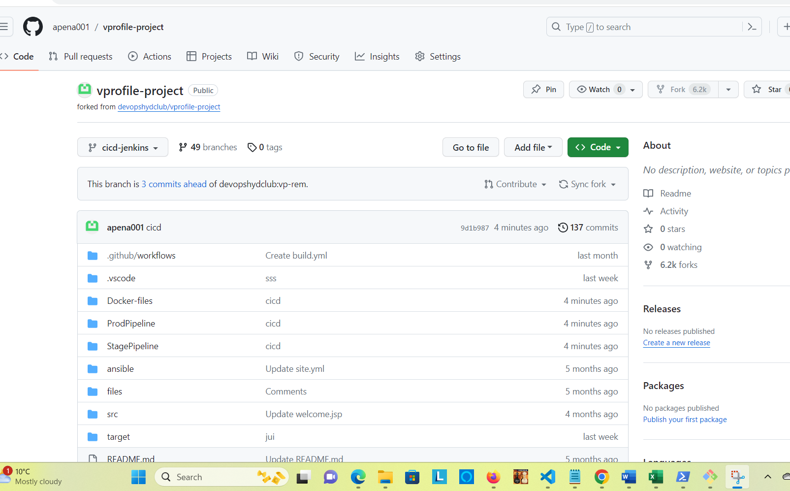
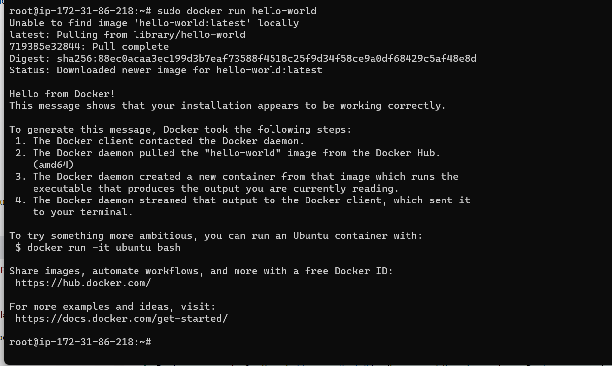
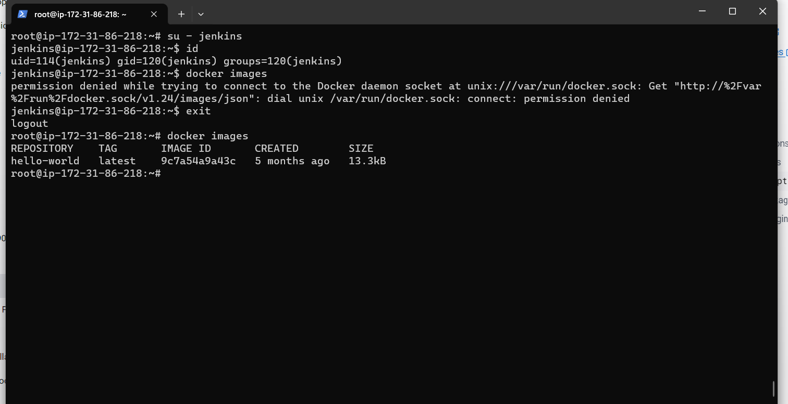
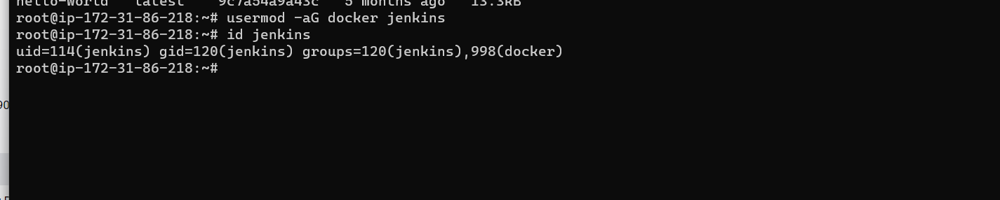

# Continuous Delivery with Jenkins and other Tools

### Tools
* Jenkins                          
* Nexus Sonatype Repository
* Sonarqube
* Maven
* Git
* Slack
* Docker
* ECR(Elastiv Container Registry)
* ECS
* AWS CLI

## Steps
* Update github webhook with new Jenkins IP
* Copy Docker File from vprofile repo to our repo
* Prepare two separate Jenkinsfile for staging and prod in source code
* AWS steps
    * IAM, ECR Repo setup
* Jenkins steps
    * Install plugins
       i.  Amazon ecr
       ii. Docker, Docker build & publish
       iii. Pipeline:AWS steps
* Install docker engine & awscli on Jenkins
* Write Jenkinsfile for Build and publish image to ECR
* ECS setup
    * Cluster, Task defination, service
* Code for Deploy Docker image to ECS
* Repeat the steps for prod ECS cluster
* Promoting docker image for prod   

### This Continuous Delivery Project is the continuation of Continuous-Integration-Using-Jenkins-Nexus-Sonarqube-and-Slack-Project

### Making sure I update the security group to allow access to my IP address

### Update the webhooks with the public IP address of the Jenkins-server

### Next we need to add Docker files and need to arrange the jenkins file for Staging and Production environment in our source code

### From our Github repository, we will switch to Docker branch and download 

dockerfile and copy the source code

### From the vprofile we clone on our local machine, we checkout into ci-jenkins and create another branch "cicd-jenkins
`git checkout -b cicd-jenkins`

### We copy the Docker file downloaded and paste into the cicd-jenkins branch

### We make 2 directory in cicd-jenkins branch named StagePipeline & ProdPipeline
`mkdir StagePipeline ProdPipeline`
### Copy JenkinsFile to StagePipeline and ProdPipeline
`cp Jenkinsfile StagePipeline`
`cp Jenkinsfile ProdPipeline`

### We we remove Jenkinsfile
`git rm Jenkinfile`
### Add and commit 
`git add .`

`git commit -m "cicd`

` git push origin cicd-jenkins`

### Creating IAM user that jenkins will use to access services like ECR and ECS and attach the following permission
* AmazonEC2ContainerRegistryFullAccess
* AmazonECSFullAccess

### Copy and save the Access Key and Secreat key
### We create ECR that will be used to store Docker images

### We login into the Jenkins-server and add the following plugins
* Doker Pipeline
* Build Tools & Publish
* Amazon ECR
* Pipeline: AWS Steps

### Also, we will go to credentails on jenkis and add the following credentails
* AWS Credentails
### we add the Access Keys and Secreat key we created on IAM user
### Next is to install Docker engine in the command line (jenkins-server)

`apt update && apt install awscli`
### Add Docker's official GPG key:
`sudo apt-get install ca-certificates curl gnupg
sudo install -m 0755 -d /etc/apt/keyrings
curl -fsSL https://download.docker.com/linux/ubuntu/gpg | sudo gpg --dearmor -o /etc/apt/keyrings/docker.gpg
sudo chmod a+r /etc/apt/keyrings/docker.gpg`

### Add the repository to Apt sources:

`echo \
  "deb [arch="$(dpkg --print-architecture)" signed-by=/etc/apt/keyrings/docker.gpg] https://download.docker.com/linux/ubuntu \
  "$(. /etc/os-release && echo "$VERSION_CODENAME")" stable" | \
  sudo tee /etc/apt/sources.list.d/docker.list > /dev/null
sudo apt-get update`
### Install the Docker packages.
`sudo apt-get install docker-ce docker-ce-cli containerd.io docker-buildx-plugin docker-compose-plugin`

### Verify that the Docker Engine installation is successful by running the hello-world image.

`sudo docker run hello-world`

### We will write the code in the jenkins-server to build the Docker image,but Docker image is built by Docker commands, so you need to have Docker engin installed in jenkins so jenkins can run the docker commands and build the docker images

### We add user mode jenkins user in the Docker group

`usermod -aG docker jenkins`

### Restart jenkins-server and re-validate the Continuos Integration to ensure it build properly
`systemctl restart jenkins`

## Docker build in pipeline
### Going into our vprofile private repository in the cicd-jenkins branch and switch to visual studio code
`code .`
### Copy the artfact from the Jinkinsfile  and updating the following
* registryCredential 
*  appRegistry 
*  vprofileRegistry 

